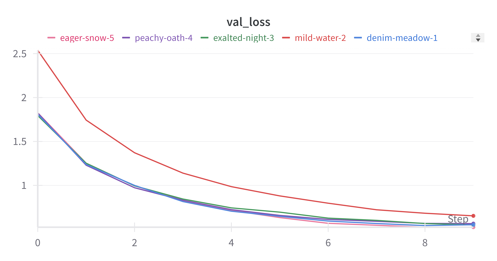

# Running Instructions
* Training - `python train.py [--d_model dimension][--n_heads num_heads][--n_layers num_layers][--dropout_rate dropout][--device device]`
* Testing - `python test.py [--d_model dimension][--n_heads num_heads][--n_layers num_layers][--dropout_rate dropout][--device device]`

## Answers to the Theory Questions

### What is the purpose of self-attention, and how does it facilitate capturing dependencies in sequences?
* Self-attention allows a model to focus on different parts of a sequence when processing each token, helping it capture dependencies between both nearby and distant tokens. It computes a weighted sum of all tokens based on learned **Query**, **Key**, and **Value** vectors, which represent relevance and information. By comparing each token's query with others' keys, the model assigns attention weights that reflect token importance. This mechanism captures long-range dependencies efficiently and enables parallelization, making it crucial for handling complex sequence relationships in transformer models.

### Why do transformers use positional encodings in addition to word embeddings? Explain how positional encodings are incorporated into the transformer architecture. Briefly describe recent advances in various types of positional encodings used for transformers and how they differ from traditional sinusoidal positional encodings.
* Transformers use positional encodings because, unlike RNNs, they process all tokens in parallel and lack inherent sequence order information. Positional encodings inject information about token positions into word embeddings, allowing the model to differentiate token order. These encodings are added to the embeddings at the input layer.

* Recent advances include **learnable positional embeddings** (trainable vectors) and **relative positional encodings**, which model relationships between token positions dynamically, as opposed to the fixed patterns in traditional sinusoidal encodings. These approaches offer more flexibility and adaptability to various tasks.

## Hyperparameter Tuning

1. model_dim = 512, 8 heads, 6 layers, dropout=0.1 : BLEU = 0.1374, loss = 0.55215
2. model_dim = 256, 8 heads, 6 layers, dropout=0.1 : BLEU = 0.13657, loss = 0.65296
3. model_dim = 512, 4 heads, 6 layers, dropout=0.1 : BLEU = 0.1374, loss = 0.55008
4. model_dim = 512, 8 heads, 3 layers, dropout=0.1 : BLEU = 0.1374, loss = 0.5647
5. model_dim = 256, 8 heads, 6 layers, dropout=0.3 : BLEU = 0.1374, loss = 0.52381

Loss Curves:

BLEU Scores:

Best hyperparams are model_dim = 512, 8 heads, 6 layers, dropout=0.1
