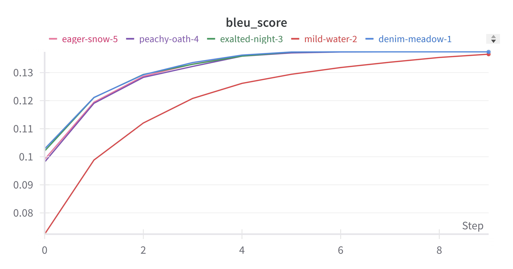

# Running Instructions
* Training - `python train.py (--args)`
* Testing - `python test.py (--args)`

## Answers to the Theory Questions

### What is the purpose of self-attention, and how does it facilitate capturing dependencies in sequences?
*

### Why do transformers use positional encodings in addition to word embeddings? Explain how positional encodings are incorporated into the transformer architecture. Briefly describe recent advances in various types of positional encodings used for transformers and how they differ from traditional sinusoidal positional encodings.
*
parser.add_argument('--d_model', type=int, default=512)
    parser.add_argument('--n_heads', type=int, default=4)
    parser.add_argument('--n_layers', type=int, default=2)
    parser.add_argument('--dropout_rate', type=float, default=0.1)
    parser.add_argument('--device', type=str, default='cpu')
    parser.add_argument('--index', type=int, default=0)

## Hyperparameter Tuning

1. model_dim = 512, 8 heads, 6 layers, dropout=0.1 : BLEU = 0.1374, loss = 0.55215
2. model_dim = 256, 8 heads, 6 layers, dropout=0.1 : BLEU = 0.13657, loss = 0.65296
3. model_dim = 512, 4 heads, 6 layers, dropout=0.1 : BLEU = 0.1374, loss = 0.55008
4. model_dim = 512, 8 heads, 3 layers, dropout=0.1 : BLEU = 0.1374, loss = 0.5647
5. model_dim = 256, 8 heads, 6 layers, dropout=0.3 : BLEU = 0.1374, loss = 0.52381

Loss Curves:

BLEU Scores:

Best hyperparams are model_dim = 512, 8 heads, 6 layers, dropout=0.1
